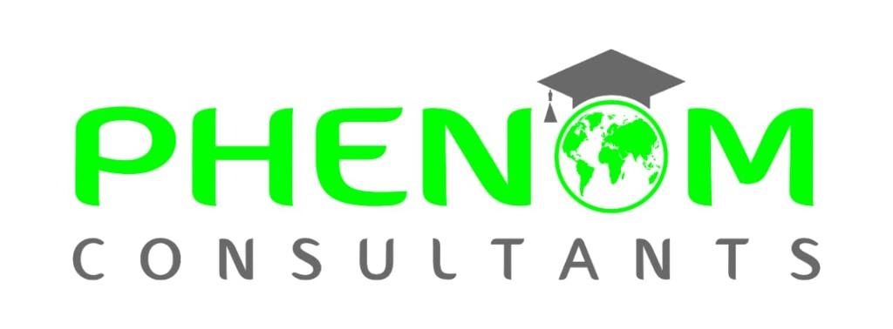

# 🎓 Phenom Consultants — Official Website

> Modern, premium, high-conversion web application for **Phenom Consultants**, Bangladesh's premier overseas education consultancy specializing in the **UK, USA, and Australia**.



---

## 🌟 Key Features

1. **Sticky Glassmorphic Navigation**:
   - Official Phenom Consultants logo with automatic fallback typography.
   - Smooth desktop navigation & mobile hamburger drawer.
   - High-visibility CTA button for instant appointment booking.

2. **Conversion-Optimized Hero Section**:
   - Compelling value proposition for Bangladeshi students.
   - Real-time intake notification (`Sept 2026 & Jan 2027`).
   - 2-Hour fast callback consultation widget.
   - Verified trust metrics (99.4% Visa Success, 150+ Partner Universities, ৳15Cr+ Scholarships).

3. **Interactive Study Destinations (UK, USA, Australia)**:
   - Filterable country cards by tag (`All`, `UK`, `USA`, `Australia`).
   - Detailed country-specific metrics (Intakes, Tuition, Post-Study Work Visa rules).
   - Interactive modal popup with university lists, IELTS/PTE requirements, and scholarship criteria.

4. **End-to-End Service Showcase**:
   - Profile evaluation & course shortlisting.
   - Fast-track admissions & application processing.
   - Scholarship negotiation (up to 70% tuition fee reduction).
   - Visa guidance, bank solvency verification, and 1-on-1 embassy mock interview prep.
   - Pre-departure briefing & accommodation assistance.

5. **Gamified 60-Second Eligibility Checker (Multi-Step Lead Funnel)**:
   - Step 1: Target Destination.
   - Step 2: Educational background & English proficiency score.
   - Step 3: Contact & location in Bangladesh.
   - Step 4: Instant dynamic eligibility results, estimated scholarship, and direct pre-filled WhatsApp lead connection.

6. **Student Success Stories & Testimonials**:
   - Authentic student reviews with approved visa badges, target universities, and scholarship sums.

7. **FAQ Accordion**:
   - Answers to crucial questions regarding bank solvency, study gaps, IELTS waivers, and work rights.

8. **Dhaka Office & Contact Information**:
   - Address in Banani, Dhaka, Bangladesh.
   - Direct hotline & WhatsApp integration.
   - Floating WhatsApp quick-chat widget.

---

## 🛠️ Tech Stack & Design Architecture

- **Markup**: Semantic HTML5 with rich SEO & Open Graph meta tags.
- **Styling**: Vanilla CSS3 design system with custom variables, glassmorphism, responsive grid, and fluid typography.
- **Typography**: Google Fonts (*Plus Jakarta Sans* & *Outfit*).
- **Icons**: Font Awesome 6 Pro/Free library.
- **Interactivity**: Clean Vanilla JavaScript (no heavy runtime dependencies).
- **Assets**: Optimized PNG official logo and responsive vector styling.

---

## 🚀 Getting Started

Simply open `index.html` in any modern web browser or host on GitHub Pages / Vercel / Netlify.

```bash
# Clone the repository
git clone https://github.com/kaziaremon/phenom-website.git

# Navigate to project folder
cd phenom-website

# Open in browser or run a lightweight local server
# e.g., using Python:
python -m http.server 3000
```

---

## 🏢 Office Location
**Phenom Consultants**  
Level 6, House 42, Road 11, Block D,  
Banani, Dhaka-1213, Bangladesh.  
📞 Hotline: +880 1700-000000 / +880 1800-000000  
📧 Email: info@phenomconsultants.com  
🌐 Website: [https://kaziaremon.github.io/phenom-website/](https://kaziaremon.github.io/phenom-website/)
